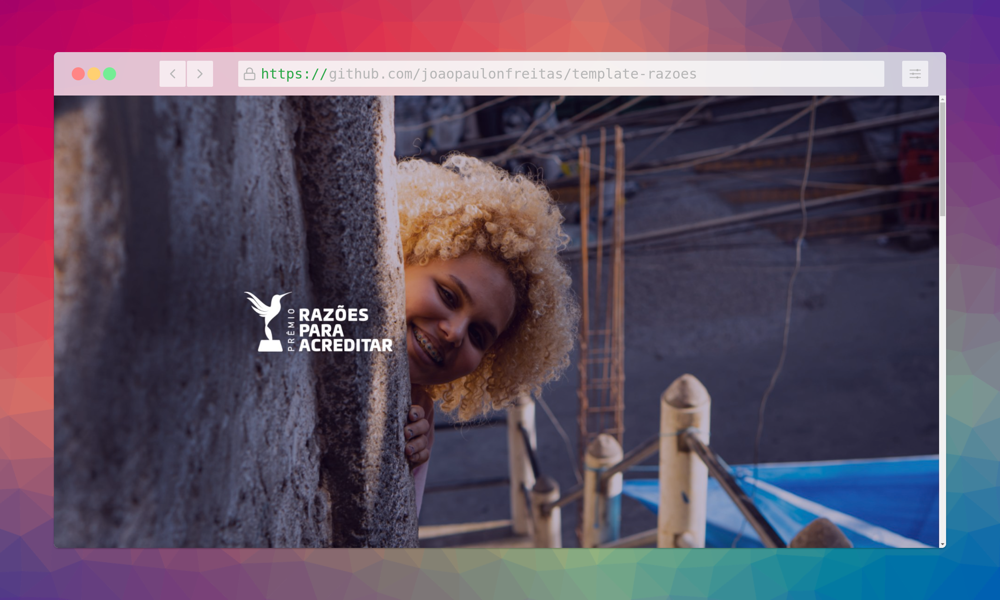
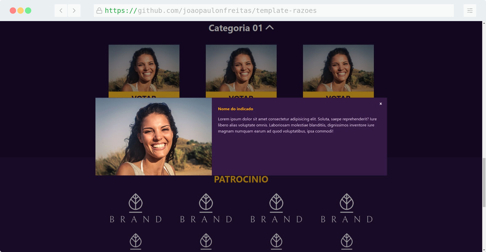
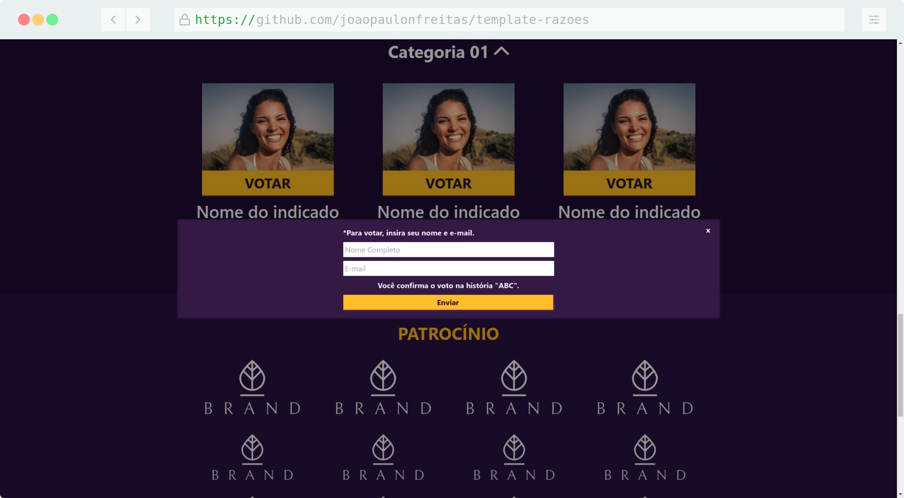
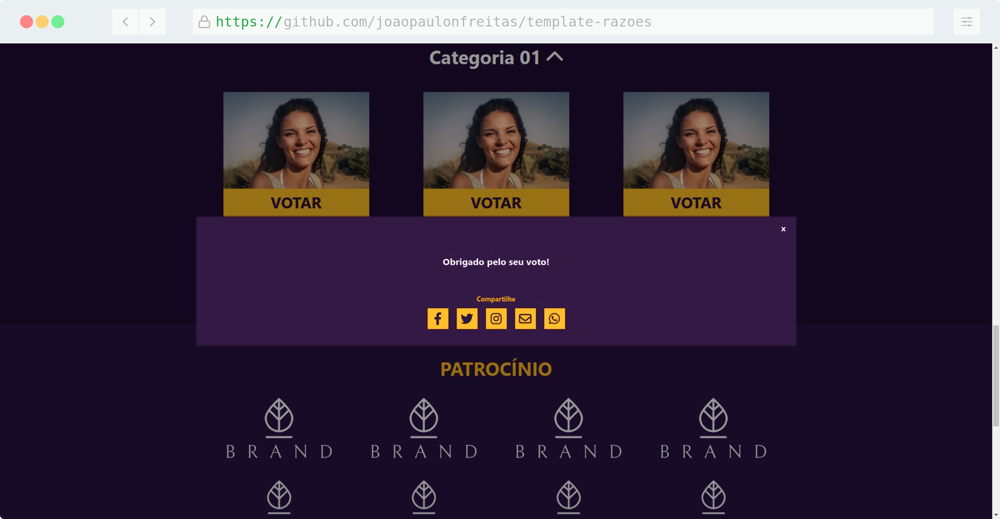

# Template: Prêmio Razões Para Acreditar
Desenvolvimento de template simples com HTML, CSS, Tailwind CSS e jQuery

 
 
 

## RWD: Designer Responsivo

<table width="100%">
    <thead>
        <tr style="text-align:center;">
            <td width="50%">Desktop</td>
            <td width="50%"></td>
        </tr>
    </thead>
    <tbody>
        <tr style="text-align:center;">
            <td style="text-align:center;"></td>
            <td></td>
        </tr>
    </tbody>
</table>

<table width="100%">
    <thead>
        <tr style="text-align:center;">
            <td width="50%">Mobile</td>
            <td width="50%"></td>
        </tr>
    </thead>
    <tbody>
        <tr style="text-align:center;">
            <td></td>
            <td></td>
        </tr>
    </tbody>
</table>

## Modais

 
 

 
 

 
 
 

# Bibliotecas / Plugins 

- Font Awesome
- Tailwind CSS
- OwlCarousel2
- JQuery
